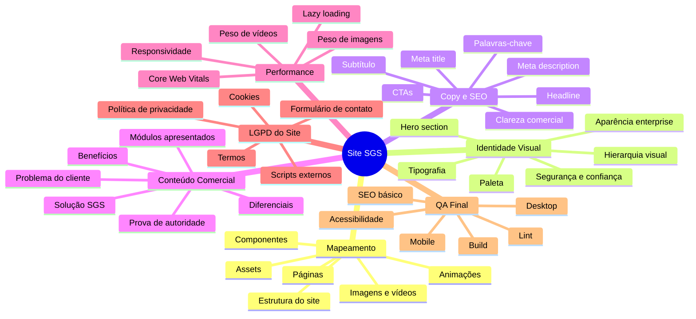

# TASK MAP — Site Institucional SGS

## Objetivo geral

Melhorar o site institucional do SGS para apresentar o produto, transmitir confiança e converter visitantes em leads.



---

## Fluxo ideal dos agentes para o site

Use este prompt no Codex:

```text
Leia AGENTS.md, TASK_MAP.md, ORCHESTRATION.md e .codex/agents.

Atenção: este projeto é o SITE INSTITUCIONAL do SGS, não o sistema/app operacional.

Use subagentes para executar a análise e melhoria do site.

Fluxo obrigatório:

1. Spawn project_mapper para mapear a estrutura real do site, páginas, componentes, estilos, imagens, vídeos, animações e assets.
2. Spawn brand_motion_director para revisar identidade visual, UI, UX, narrativa visual, animações e aparência enterprise.
3. Spawn seo_copy_strategist para revisar headline, subtítulo, CTAs, SEO, meta tags, textos comerciais e conversão.
4. Aguarde os relatórios dos três agentes.
5. Consolide um plano de implementação objetivo.
6. Spawn frontend_implementer para implementar somente as melhorias aprovadas no plano.
7. Spawn appsec_lgpd_reviewer para revisar privacidade, LGPD, scripts externos, formulários, cookies, variáveis públicas e exposição de dados.
8. Spawn qa_build_reviewer para validar lint, build, responsividade, acessibilidade básica, SEO básico e regressões.
9. Entregue relatório final.

Regras:
- Não transformar o site em sistema/app.
- Não criar módulos internos de APR, DDS, PT ou dashboard operacional.
- Usar esses módulos apenas como conteúdo comercial.
- Não mexer em .env.
- Não expor secrets.
- Não instalar dependências sem justificar.
- Preservar performance.
- Priorizar clareza, confiança, conversão e aparência profissional.
```
